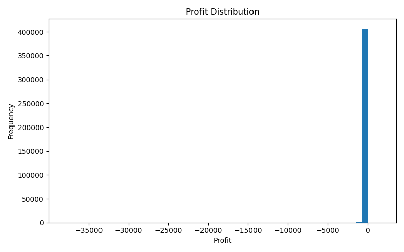
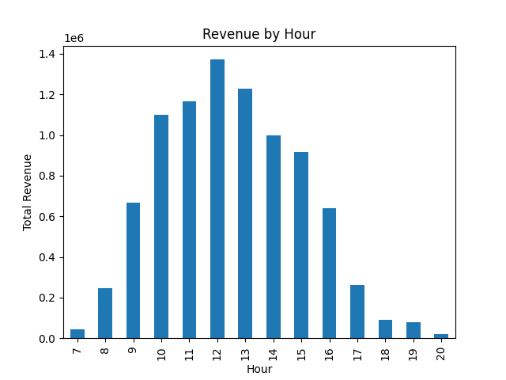
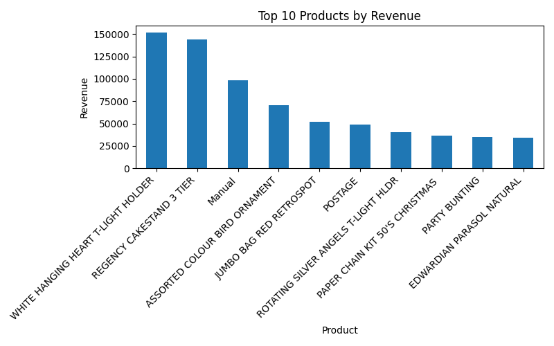

# 🍽️ Restaurant Revenue & Profit Optimization
## 🔥 Key Result

> 📉 Despite generating ~8.8M in revenue, the business is largely loss-making due to poor unit economics.

> 🚀 An end-to-end data analysis project exploring a simple but important question:
> **Why do some businesses generate high revenue but still struggle to make profit?**

---

## 🔍 What I Found

> 📉 Even though the business generates strong revenue (~8.8M), most transactions are actually **loss-making**.

This project shows that:
👉 High sales don’t always mean a healthy business.

---

## ⚡ Key Highlights

* 💰 Analyzed ~8.8M revenue across ~19K orders
* 📉 Found that most transactions are not profitable
* 👥 High-spending customers were contributing the most to losses
* ⏰ Clear demand patterns (midday peaks, seasonal spikes)
* 🤖 Built a simple ML model to explore profitability prediction

---

## 📊 Visual Insights
> Majority of transactions are loss-making, indicating a fundamentally unsustainable model.

### 📉 Profit Distribution

> Most transactions fall into the loss-making zone — a clear sign of structural issues.

---

### ⏰ Demand by Hour

> Orders peak around midday, showing strong time-based behavior.

---

### 🛒 Top Products by Revenue

> A small number of products drive most of the revenue.

---

## 🎯 The Problem

Food delivery businesses often:

* generate high order volumes
* attract many customers
* grow revenue quickly

But still struggle with profitability due to:

* high platform commissions
* aggressive pricing/discounts
* operational costs

👉 So the real question becomes:
**Are we actually growing profit — or just scaling losses?**

---

## 📦 Dataset

I used a transaction-level dataset and mapped it to a restaurant context:

* each transaction → an order
* each product → a menu item

### Key fields:

* Order ID
* Item Name
* Quantity
* Price
* Customer ID
* Order Time

---

## 🧹 Data Preparation

Before analysis, I:

* removed cancelled transactions
* handled missing values
* converted date fields
* created useful features like:

  * revenue
  * hour, month

This step made the dataset ready for real analysis.

---

## 📈 What I Explored

* Which products drive revenue
* When customers order (time patterns)
* How revenue is distributed
* Customer behavior and repeat orders

---

## 💰 Profit Simulation (The Turning Point)

Since profit wasn’t available, I estimated it using:

* Cost = 60% of price
* Commission = 25%
* Packaging cost per item

### 🔥 What this revealed:

> Most “successful” transactions (high revenue) were actually **loss-making**.

This completely changed how I looked at the data.

---

## 👥 Customer Segmentation

I grouped customers into:

* Low
* Medium
* High value

### 🔥 Surprising insight:

> High-value customers were generating the **highest losses**

Meaning:
👉 More orders ≠ more profit
👉 Engagement was actually amplifying losses

---

## 🤖 Machine Learning (Support Layer)
> Due to extreme class imbalance, the model is better suited as a screening tool rather than a reliable decision system.

I built a Logistic Regression model to predict:

* profitable vs loss-making customers

### What I learned:

* The dataset was highly imbalanced
* Model achieved high recall but very low precision
* Profitability is hard to predict with limited features

👉 This reinforced the idea that the issue is **business structure**, not just data patterns.

---

## 🔍 Key Insights

* Revenue is concentrated in a few products and customers
* High demand does not guarantee profit
* High-value customers can be harmful if margins are low
* The business is scaling losses, not profit
* Pricing, cost, and commissions are the root issues

---
## 📌 Why This Matters

> Many businesses focus on growth metrics like revenue and orders, but without controlling costs and margins, growth can actually increase losses.

## 💡 What I Would Recommend

If this were a real business, I would:

- Increase prices or reduce costs for high-volume loss-making items
- Remove consistently loss-making products from the menu
- Shift KPIs from revenue → profit and margin
- Focus retention efforts on profitable customers

---

## 🚀 Final Takeaway

> This project showed me that growth without profitability can be misleading.

A business can look successful from the outside (high revenue),
but still struggle internally due to poor unit economics.

---

## 🛠️ Tools Used

* Python
* Pandas
* Matplotlib / Seaborn
* Scikit-learn

---

## 📁 Project Structure

restaurant-project/
├── data/
├── notebook/
│   └── analysis.ipynb
├── outputs/
├── README.md

---

## 👤 Author

S TANUSREE

---
